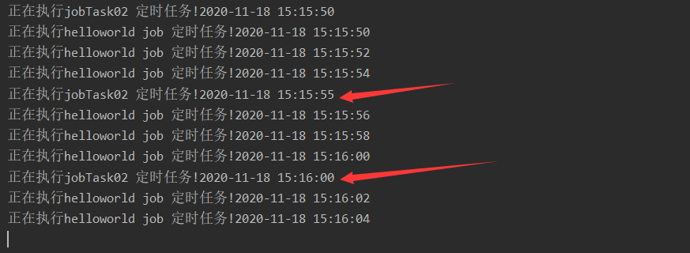

# [Quartz实现JAVA定时任务的动态配置](https://www.cnblogs.com/laoyeye/p/9352002.html)

[TOC]

## 什么是动态配置定时任务？

首先说下这次主题，动态配置。没接触过定时任务的同学可以先看下此篇：[JAVA定时任务实现的几种方式](https://www.cnblogs.com/laoyeye/p/6530791.html)
> 定时任务实现方式有多种：
> 1、JDK 的Timer类 
> 2、Quartz 
> 3、SpringTask 
> 生产上三种方式使用过程中用的最多的便是xml配置的方式，这种方式最简单，无代码侵入，也比较好理解。
> 但是却有个致命的缺点，比如你要改某个任务的触发时间，亦或是你要新增一个任务，暂停一个任务。怎么做？
> 停应用！改XML配置！重新启动！这样不是很友好。
> 该demo使用Quartz的配置，实现了不停机添加、暂停、删除、立即触发任务的方法。

## 环境准备：

* ①一个基础的web项目，包含了定时任务表sys_task的CRUD
建表语句
```sql
CREATE TABLE `sys_task` (
  `id` bigint(20) NOT NULL AUTO_INCREMENT,
  `job_name` varchar(255) DEFAULT NULL COMMENT '任务名',
  `description` varchar(255) DEFAULT NULL COMMENT '任务描述',
  `cron_expression` varchar(255) DEFAULT NULL COMMENT 'cron表达式',
  `bean_class` varchar(255) DEFAULT NULL COMMENT '任务执行时调用哪个类的方法 包名+类名',
  `job_status` varchar(255) DEFAULT NULL COMMENT '任务状态,0:关闭，1:开启',
  `job_group` varchar(255) DEFAULT NULL COMMENT '任务分组',
  `create_user` varchar(64) DEFAULT NULL COMMENT '创建者',
  `create_time` datetime DEFAULT NULL COMMENT '创建时间',
  `update_user` varchar(64) DEFAULT NULL COMMENT '更新者',
  `update_time` datetime DEFAULT NULL COMMENT '更新时间',
  PRIMARY KEY (`id`)
) ENGINE=MyISAM AUTO_INCREMENT=32 DEFAULT CHARSET=utf8;
```
* ②quartz的maven依赖
```xml
<!-- quartz -->
<dependency>
    <groupId>org.quartz-scheduler</groupId>
    <artifactId>quartz</artifactId>
    <version>2.2.1</version>
</dependency>
<dependency>
    <groupId>org.springframework</groupId>
    <artifactId>spring-context-support</artifactId>
</dependency>
```
## 实现步骤

①启动项目，启动task监听
②读取数据库，将开启的任务job和trigger加载到scheduler调度器
③根据任务调度运行job类
④每次运行利用AdaptableJobFactory实例化job类，以便注入要运行的service

代码逻辑

quartz配置

```java
package com.wyp.quartzdemo.config;

import org.quartz.Scheduler;
import org.quartz.spi.JobFactory;
import org.springframework.beans.factory.annotation.Autowired;
import org.springframework.beans.factory.config.PropertiesFactoryBean;
import org.springframework.context.annotation.Bean;
import org.springframework.context.annotation.Configuration;
import org.springframework.core.io.ClassPathResource;
import org.springframework.scheduling.quartz.SchedulerFactoryBean;

import java.io.IOException;
import java.util.Properties;

@Configuration
public class QuartzConfigration {

    @Autowired
    private JobFactory jobFactory;

    @Bean
    public SchedulerFactoryBean schedulerFactoryBean() {
        SchedulerFactoryBean schedulerFactoryBean = new SchedulerFactoryBean();
        try {
            schedulerFactoryBean.setOverwriteExistingJobs(true);
            schedulerFactoryBean.setQuartzProperties(quartzProperties());
            schedulerFactoryBean.setJobFactory(jobFactory);
        } catch (Exception e) {
            e.printStackTrace();
        }
        return schedulerFactoryBean;
    }

    // 指定quartz.properties，可在配置文件中配置相关属性
    @Bean
    public Properties quartzProperties() throws IOException {
        PropertiesFactoryBean propertiesFactoryBean = new PropertiesFactoryBean();
        propertiesFactoryBean.setLocation(new ClassPathResource("/config/quartz.properties"));
        propertiesFactoryBean.afterPropertiesSet();
        return propertiesFactoryBean.getObject();
    }

    // 创建schedule
    @Bean(name = "scheduler")
    public Scheduler scheduler() {
        return schedulerFactoryBean().getScheduler();
    }
}
```

**监听器**

```java
package com.wyp.quartzdemo.listener;

import com.wyp.quartzdemo.service.TaskService;
import org.springframework.beans.factory.annotation.Autowired;
import org.springframework.boot.CommandLineRunner;
import org.springframework.core.annotation.Order;
import org.springframework.stereotype.Component;

@Component
@Order(value = 1)
public class ScheduleJobInitListener implements CommandLineRunner {

    @Autowired
    TaskService scheduleJobService;

    @Override
    public void run(String... arg0) throws Exception {
        try {
            scheduleJobService.initSchedule();
        } catch (Exception e) {
            e.printStackTrace();
        }

    }

}
```

**第二步：读取数据库，加载scheduler调度器**

taskServiceImpl.java文件中获取sys_tasks表中所有定时任务，加载到scheduler调度器中

```java
@Override
public void initSchedule() throws SchedulerException {
    // 这里获取任务信息数据
    List<Task> jobList = taskDao.queryAll(null);
    for (Task task : jobList) {
        if (JobStatusEnum.RUNNING.getCode().equals(task.getJobStatus())) {
            quartzManager.addJob(task);
        }
    }
}
```

添加任务到Quartz调度器

```java
@SuppressWarnings("unchecked")
public void addJob(Task task) {
    try {
        // 创建jobDetail实例，绑定Job实现类
        // 指明job的名称，所在组的名称，以及绑定job类

        Class<? extends Job> jobClass = (Class<? extends Job>) (Class.forName(task.getBeanClass()).newInstance()
                .getClass());
        JobDetail jobDetail = JobBuilder.newJob(jobClass).withIdentity(task.getJobName(), task.getJobGroup())// 任务名称和组构成任务key
                .build();
        // 定义调度触发规则
        // 使用cornTrigger规则
        Trigger trigger = TriggerBuilder.newTrigger().withIdentity(task.getJobName(), task.getJobGroup())// 触发器key
                .startAt(DateBuilder.futureDate(1, IntervalUnit.SECOND))
                .withSchedule(CronScheduleBuilder.cronSchedule(task.getCronExpression())).startNow().build();
        // 把作业和触发器注册到任务调度中
        scheduler.scheduleJob(jobDetail, trigger);
        // 启动
        if (!scheduler.isShutdown()) {
            scheduler.start();
        }
    } catch (Exception e) {
        e.printStackTrace();
    }
}
```

> Scheduler作为Quartz的核心调度器，有将近50多个API接口，包括任务的添加，暂停，恢复，删除等一系列的API，这里仅介绍一些常用的，想要了解更多可以稍后看下彩蛋部分。
> 1、start()方法：只有调用start()方法后，Scheduler线程才开始启动触发器trigger，运行job
> 2、pauseJob(JobKey jobKey) ：根据指定的JobDetail key暂停job。
> 3、resumeJob(JobKey jobKey) ：根据指定的key恢复一个job。
> 4、deleteJob(JobKey jobKey) ：删除一个job
> 5、triggerJob(JobKey jobKey) ：触发一个JobDetail(现在执行)。
> 6、rescheduleJob(TriggerKey triggerKey, Trigger newTrigger)：
> 用给定的键删除触发器，并存储新的触发器，它必须与同一个作业相关联（新触发器必须具有指定的作业名和组）-然而，新触发器不必具有与旧触发器相同的名称。

**第三步：根据任务调度运行job类**
其实这一步是不需要我们编写的，在我们将正确的JobDetail 和 Trigger 表达式加载到任务调度后，调度器会自动触发任务的执行

 工厂类

```java
package com.wyp.quartzdemo.factory;

import org.quartz.spi.TriggerFiredBundle;
import org.springframework.beans.factory.annotation.Autowired;
import org.springframework.beans.factory.config.AutowireCapableBeanFactory;
import org.springframework.scheduling.quartz.AdaptableJobFactory;
import org.springframework.stereotype.Component;

@Component
public class JobFactory extends AdaptableJobFactory {
    //这个对象Spring会帮我们自动注入进来,也属于Spring技术范畴.
    //为什么需要这个类呢，在我写的这个demo中，大家可以将此类删掉，发现程序也可以正常运营，可是我为什么还是加上呢。
    //大家可以看下我们的任务类，大家可以看到Job对象的实例化过程是在Quartz中进行的，这时候我们将spring的东西注入进来，肯定是行不通的，所以需要这个类
    @Autowired
    private AutowireCapableBeanFactory capableBeanFactory;

    @Override
    protected Object createJobInstance(TriggerFiredBundle bundle) throws Exception {
        //调用父类的方法
        Object jobInstance = super.createJobInstance(bundle);
        //进行注入
        capableBeanFactory.autowireBean(jobInstance);
        return jobInstance;
    }
}
```
**第四步：实例化job类，注入要运行的service**
 任务类

```java
package com.wyp.quartzdemo.tasks;

import com.wyp.quartzdemo.utils.DateUtils;
import org.quartz.DisallowConcurrentExecution;
import org.quartz.Job;
import org.quartz.JobExecutionContext;
import org.quartz.JobExecutionException;
import org.springframework.stereotype.Component;

import java.util.Date;

@DisallowConcurrentExecution //作业不并发
@Component
public class HelloWorldJob implements Job {

    @Override
    public void execute(JobExecutionContext arg0) throws JobExecutionException {
        System.out.println("正在执行helloworld job 定时任务!"+ DateUtils.fullTime(new Date())); 
    }

}
```

测试：
启动项目时候启动两个定时任务，id为1的每2秒执行一次，id为2的每5秒执行一次


启动项目后


调用停止job的接口：localhost:8001/task/stopTask?taskId=1
只有id为2的定时任务在执行，id为1的定时任务没有再执行


再次调用恢复job的接口：localhost:8001/task/resumeTask?taskId=1
id为1的定时任务再次开始执行
